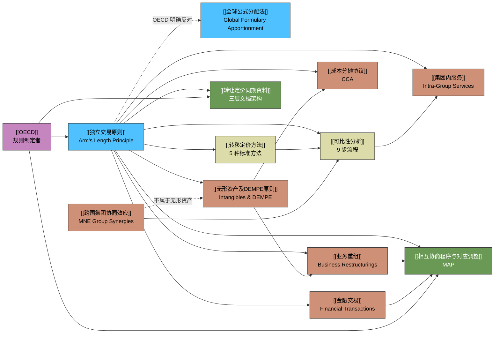
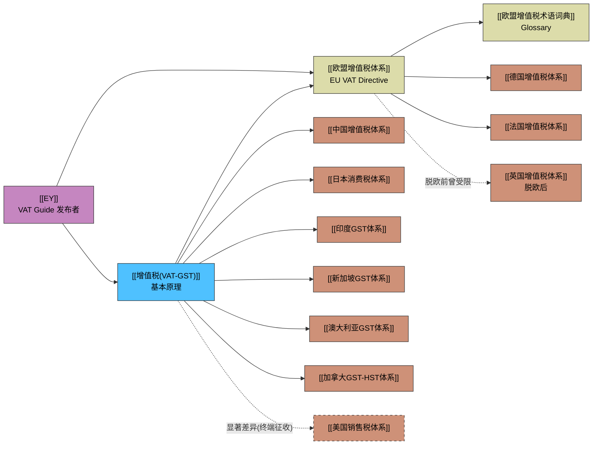

# 知识图谱 (Knowledge Graph)

> 以下 Mermaid 图谱展示知识库中核心概念之间的语义关联。
> 箭头方向表示"依赖/引用"关系，虚线表示"对比/互斥"关系。

## 1. 直接税体系 (Transfer Pricing)

## 2. 间接税体系 (Indirect Tax)

## 图例

| 颜色 | 类别 | 包含页面 |
|------|------|---------|
| 🔵 蓝色 | 核心原则/基础 | 独立交易原则、增值税原理 |
| 🟡 黄色 | 方法论/区域框架 | 转移定价方法、EU VAT体系 |
| 🟠 橙色 | 交易类型/国家实践 | 业务重组、中国增值税、德国增值税等 |
| 🟢 绿色 | 合规与争端 | 同期资料、MAP |
| 🟣 紫色 | 实体 | OECD、EY |
